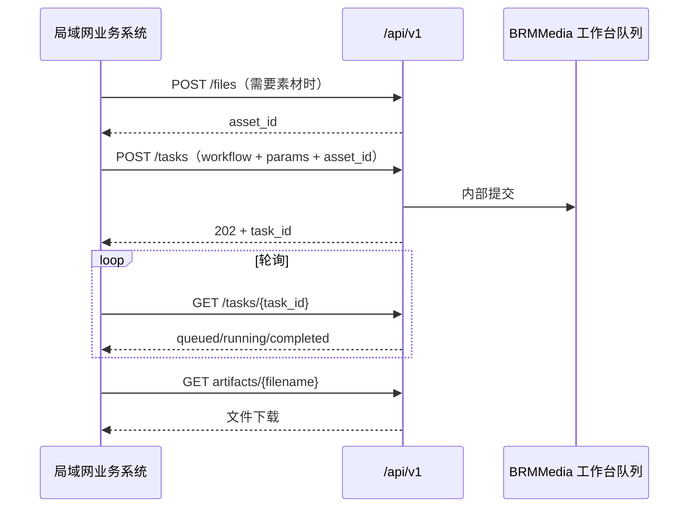

# BRMMedia 局域网 API

> **更新日期：2026-08-05**
> 推荐业务系统调用稳定 REST API v1。原有 Gradio API 保留给既有脚本与工作台调试，不建议新业务继续依赖它的 SSE 协议。

## 1. 入口、认证与快速检查

| 项目 | 规则 |
| --- | --- |
| 局域网入口 | `http://<Windows-LAN-IP>` |
| REST API 根路径 | `http://<Windows-LAN-IP>/api/v1` |
| OpenAPI | `GET /api/v1/openapi.json`；交互文档 `GET /api/v1/docs` |
| 认证 | Nginx HTTP Basic Auth；账号密码只保存在私有 `DEPLOYMENT.md` 或密码管理器，不进入 Git、代码与命令历史 |
| 内部服务 | Gradio `9000`、ComfyUI `8188`、LAN API `9100`、Qwen `8000` 都只监听 WSL 回环地址，不能直接从局域网访问 |

Windows 使用 DHCP 时，LAN IP 可能变化。请以服务器物理网卡的 `ipconfig` IPv4 为准，或在路由器中为其设置 DHCP 固定租约；不要在客户端代码中写死旧地址。

```bash
export BRM_BASE='http://<Windows-LAN-IP>'
export BRM_API="$BRM_BASE/api/v1"
export BRM_USER='brmadmin'
# 不要把密码写入 shell 历史。
read -rs BRM_PASSWORD; echo

curl --fail --user "$BRM_USER:$BRM_PASSWORD" "$BRM_API/health"
curl --fail --user "$BRM_USER:$BRM_PASSWORD" "$BRM_API/capabilities"
```

`health` 返回 `200` 且 `status: ok` 说明 Gradio 与 ComfyUI 可用；依赖未就绪时返回 `503` 和 `degraded`。`capabilities` 给出本次部署支持的工作流、尺寸、素材字段、上传上限与素材有效期，是客户端生成表单和校验规则的唯一依据。

## 2. 推荐调用闭环



- `asset_id` 是上传素材的短期引用，默认保留 7 天；过期后重新上传即可。
- `POST /tasks` 返回 `202 Accepted` 仅表示进入工作台队列，**不表示生成完成**。
- `GET /tasks/{task_id}` 的 `state` 为 `completed` 后才会出现 `artifacts`；使用其中的 `download_url` 下载。服务器绝对路径不会出现在任一响应中。
- 不提供外部“中断当前任务”接口：ComfyUI 中断是全局动作，可能误伤其他调用方，必须由工作台操作员确认。

## 3. 上传素材

`POST /files?kind=image` 或 `POST /files?kind=audio`，请求为 `multipart/form-data`，文件字段名固定为 `file`。

支持图片 `png/jpg/jpeg/webp/bmp/gif`，音频 `mp3/wav/flac/m4a/aac/ogg`。上传上限默认 256 MiB，以 `/capabilities` 的 `max_upload_bytes` 为准。服务会把素材安全导入 ComfyUI 输入区，调用者不需要、也不能提供服务器路径。

```bash
IMAGE_JSON=$(curl --fail --user "$BRM_USER:$BRM_PASSWORD" \
  -F 'file=@./reference.png' \
  "$BRM_API/files?kind=image")

IMAGE_ASSET_ID=$(printf '%s' "$IMAGE_JSON" | python3 -c 'import json,sys; print(json.load(sys.stdin)["asset_id"])')
```

音频上传响应额外包含 `duration`，供数字人工作流直接使用：

```json
{
  "asset_id": "aabbcc...",
  "kind": "audio",
  "source_filename": "voice.wav",
  "size_bytes": 483920,
  "sha256": "…",
  "duration": 8.742,
  "expires_at": 1780000000.0
}
```

## 4. 提交任务

`POST /tasks`，JSON 请求体：

```json
{
  "workflow": "text-to-image",
  "params": {
    "prompt": "清晨薄雾中的湖畔木屋，电影感",
    "size": "1024 × 1024",
    "batch": 1
  }
}
```

```bash
curl --fail --user "$BRM_USER:$BRM_PASSWORD" \
  -H 'Content-Type: application/json' \
  -d '{"workflow":"text-to-image","params":{"prompt":"清晨薄雾中的湖畔木屋，电影感","size":"1024 × 1024","batch":1}}' \
  "$BRM_API/tasks"
```

成功返回 `202`：

```json
{
  "task_id": "0123456789abcdef0123456789abcdef",
  "workflow": "text-to-image",
  "state": "accepted",
  "queue_position": 1,
  "links": {"status": "/api/v1/tasks/0123456789abcdef0123456789abcdef"}
}
```

### 工作流与参数

| workflow | 必填参数 | 可选参数/素材 |
| --- | --- | --- |
| `text-to-image` | `prompt` | `size`（默认 `1024 × 1024`）、`batch`（1–4） |
| `image-edit` | `prompt`、`image_asset_id` | 图片编辑 |
| `text-to-video` | `prompt` | `size`（默认 `768 × 1024`）、`seconds`（2–360） |
| `image-to-video` | `prompt`、`image_asset_id` | `seconds`（2–360） |
| `first-last-frame-video` | `prompt`、`first_image_asset_id`、`last_image_asset_id` | `seconds`（2–360） |
| `talking-head` | `prompt`、`image_asset_id`、`audio_asset_id`、`duration` | `size`（默认 `768 × 1024`）；应使用上传音频返回的 `duration` |
| `voice-clone` | `prompt`、`ref_audio_asset_id` | `temperature`（0–1.5，默认 0.8） |
| `music-generate` | `tags` | `lyrics`、`duration`（1–600）、`bpm`（30–300）、`language`、`model`（仅限 `/capabilities` 当前列出的已安装权重） |

例如，图片编辑使用上传得到的引用：

```bash
curl --fail --user "$BRM_USER:$BRM_PASSWORD" \
  -H 'Content-Type: application/json' \
  -d "{\"workflow\":\"image-edit\",\"params\":{\"prompt\":\"改成黄昏暖色调\",\"image_asset_id\":\"$IMAGE_ASSET_ID\"}}" \
  "$BRM_API/tasks"
```

非法参数、类型不匹配的素材引用和过期素材均返回 `422`；工作台或 ComfyUI 不可用返回 `503`；文件上传到 ComfyUI 失败返回 `502`。

## 5. 查询与下载

```bash
TASK_ID='<POST /tasks 返回的 task_id>'
curl --fail --user "$BRM_USER:$BRM_PASSWORD" "$BRM_API/tasks/$TASK_ID"
```

示例完成状态：

```json
{
  "task_id": "0123456789abcdef0123456789abcdef",
  "state": "completed",
  "status": "已完成",
  "finished_at": 1780000000.0,
  "error": null,
  "artifacts": [
    {
      "name": "任务_文生图_20260805-090000_1234.png",
      "download_url": "/api/v1/tasks/0123456789abcdef0123456789abcdef/artifacts/任务_文生图_20260805-090000_1234.png"
    }
  ]
}
```

可按 2–5 秒间隔轮询。`state` 的含义：

| state | 含义 |
| --- | --- |
| `queued` | 已受理，等待工作台 worker |
| `running` | 正在生成 |
| `completed` | 已完成，可下载 `artifacts` |
| `cancelled` | 已由工作台操作员中断或清空队列 |
| `failed` | 生成失败，查看安全摘要 `error` |

下载时复用 Basic Auth。客户端应直接使用服务返回的 `download_url`，不要猜测文件名或内部目录：

```bash
curl --fail --user "$BRM_USER:$BRM_PASSWORD" \
  --remote-name \
  "$BRM_BASE/api/v1/tasks/$TASK_ID/artifacts/<服务返回的 name>"
```

## 6. Qwen OpenAI 兼容 API

Qwen 与生成队列独立，入口是 `http://<Windows-LAN-IP>/qwen/v1`：

```bash
curl --user "$BRM_USER:$BRM_PASSWORD" "$BRM_BASE/qwen/v1/models"

curl --user "$BRM_USER:$BRM_PASSWORD" \
  "$BRM_BASE/qwen/v1/chat/completions" \
  -H 'Content-Type: application/json' \
  -d '{
    "model": "qwen35-4b-awq",
    "messages": [{"role": "user", "content": "请用一句话介绍自己。"}],
    "temperature": 0.7
  }'
```

常规模式下 Qwen 使用 GPU0；切换至高显存视频模式时 Qwen 会停止，这是预期行为。工作台中的“Qwen 大模型”标签页适合浏览器内流式验证。

## 7. 兼容层：原 Gradio API

旧脚本仍可使用 `GET /gradio_api/info` 与九个固定端点：`/submit_workflow_1` 至 `/submit_workflow_8`、`/task_status`。它们使用 Gradio v2 POST + SSE，上传文件名需已经在 ComfyUI 输入目录中；因此不适合新业务系统。

仓库工具 [`call_gradio_api.py`](call_gradio_api.py) 已支持局域网 Basic Auth，密码只能从环境变量读取：

```bash
export BRM_USER='brmadmin'
read -rs BRM_PASSWORD; echo
python3 call_gradio_api.py submit_workflow_1 \
  '["一只坐在窗边的橘猫", "512 × 512", 1]' \
  --base-url "$BRM_BASE" --timeout 60
```

其 `COMPLETE=` 仅表示任务进入工作台队列。请用对应 `task_id` 调用 REST `GET /api/v1/tasks/{task_id}` 查询真实完成状态。

## 8. 运维与变更约定

- `brmmedia-lan-api` 是独立 systemd 服务，监听 `127.0.0.1:9100`；Nginx `/api/` 代理是唯一对外入口。
- 部署、服务器恢复或更新后，执行 `sudo brmmedia-verify-runtime`；只有 `RESULT=PASS` 才算验收通过。
- 修改任何 workflow 参数、上传限制或 REST 响应时，必须同步更新 `capabilities`、本文件、私有 `DEPLOYMENT.md` 与运行时验收。
- 所有自动化调用都应设置超时、轮询退避和重试上限；不要用并发堆积替代队列调度。视频、数字人等高显存任务通常建议工作台并发为 1。
