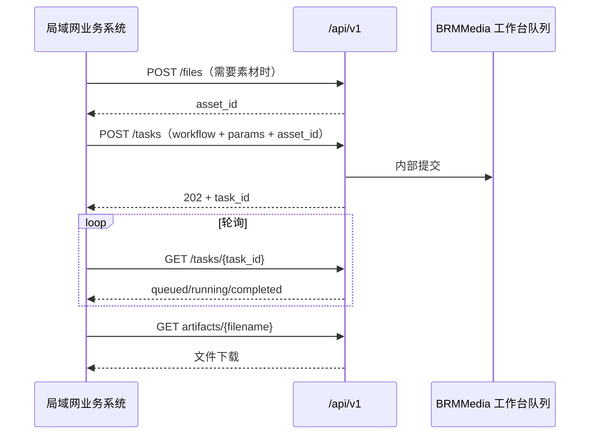

# BRMMedia 局域网 API

> **更新日期：2026-08-19**
> **当前生产快照：** MiniMax H3 / IndexTTS-2.5 / ACE-Step 1.5 均通过单媒体队列使用 A5000；Qwen 使用 `qwen38-27b-q4-k-m`，通过两张 A4000 运行。本文件不包含任何密码、Token、内网绝对路径或模型文件路径。
>
> 推荐业务系统调用稳定 REST API v1；原有 Gradio API 仅保留给既有脚本与工作台调试。Qwen 则使用 OpenAI 兼容 API。不要把任何回环端口、ComfyUI 内部 API 或 Gradio 私有端点当成稳定集成接口。

## 1. 入口、认证与快速检查

| 项目 | 规则 |
| --- | --- |
| 局域网入口 | `http://172.16.28.8`（当前生产地址；如 DHCP 变化，以部署记录和 `ipconfig` 为准） |
| REST API 根路径 | `http://172.16.28.8/api/v1` |
| OpenAPI | `GET /api/v1/openapi.json`；交互文档 `GET /api/v1/docs` |
| 认证 | Nginx HTTP Basic Auth；账号密码只保存在私有 `DEPLOYMENT.md` 或密码管理器，不进入 Git、代码与命令历史 |
| Qwen 兼容入口（旧） | `http://172.16.28.8/qwen/v1`（OpenAI 兼容，Nginx Basic Auth；仅兼容已有局域网调用） |
| Qwen 业务入口（推荐） | `http://172.16.28.8/qwen-api/v1`（OpenAI 兼容，Bearer API Key；密钥由管理员独立创建、轮换和撤销） |
| 内部服务 | Gradio `9000`、ComfyUI `8188`、LAN API `9100`、IndexTTS‑2.5 `9205`、Qwen3.8 `8001` 都只监听 WSL 回环地址，不能直接从局域网访问 |
| ComfyUI 管理 | `http://172.16.28.8/comfyui/`；复用同一 Basic Auth，仅供管理员编辑、排查和测试可视化工作流 |
| 公网状态 | **未开放。** 当前接口仅面向局域网；如要给云端 Agent 调用，必须另行部署 HTTPS、独立 API Key、限流与访问控制，不能直接端口映射当前入口。 |

Windows 使用 DHCP 时，LAN IP 可能变化。请以服务器物理网卡的 `ipconfig` IPv4 为准，或在路由器中为其设置 DHCP 固定租约；不要在客户端代码中写死旧地址。
在其他环境部署时，以 `http://<Windows-LAN-IP>/` 作为站点根地址模板，再替换为该主机的实际局域网 IP。

```bash
export BRM_BASE='http://172.16.28.8'
export BRM_API="$BRM_BASE/api/v1"
export BRM_USER='brmadmin'
# 不要把密码写入 shell 历史。
read -rs BRM_PASSWORD; echo

curl --fail --user "$BRM_USER:$BRM_PASSWORD" "$BRM_API/health"
curl --fail --user "$BRM_USER:$BRM_PASSWORD" "$BRM_API/capabilities"
```

`health` 返回 `200` 且 `status: ok` 说明 Gradio 与 ComfyUI 可用；依赖未就绪时返回 `503` 和 `degraded`。`capabilities` 给出**当前实际可用**的工作流、尺寸、素材字段、上传上限与素材有效期；H3 视频工作流还会在 `workflows.<workflow>.options.params` 返回字段类型、必填项、默认值和枚举。完整 HTTP 请求/响应结构以 OpenAPI 为准。

### 给开发与 Agent 的调用原则

1. 每次会话启动先读取 `/health` 与 `/capabilities`；不要把某次部署的枚举、音乐权重名或 H3 画布写死。
2. 图片、音频先上传成 `asset_id`，再把 `asset_id` 放入 `POST /tasks`；不得传服务器路径、Windows 路径或 WSL 路径。
3. 媒体生成是异步任务：提交成功是 `202`，只在 `GET /tasks/{task_id}` 为 `completed` 后下载产物。
4. Qwen 对话是同步/流式接口，与媒体任务队列无关；新系统使用 `/qwen-api/v1/models` 发现模型，认证为独立 Bearer API Key。
5. 任何 `4xx` 都应修正请求后再提交；`5xx/503` 可以使用有限次数的指数退避重试，禁止无上限并发重放。

## 2. 推荐调用闭环



- `asset_id` 是上传素材的短期引用，默认保留 7 天；过期后重新上传即可。
- `POST /tasks` 返回 `202 Accepted` 仅表示进入工作台队列，**不表示生成完成**。
- `GET /tasks/{task_id}` 的 `state` 为 `completed` 后才会出现 `artifacts`；使用其中的 `download_url` 下载。服务器绝对路径不会出现在任一响应中。
- 不提供外部“中断当前任务”接口：ComfyUI 中断是全局动作，可能误伤其他调用方，必须由工作台操作员确认。

### REST 端点速查

| 方法 | 路径 | 用途 | 成功状态 |
| --- | --- | --- | --- |
| `GET` | `/api/v1/health` | 检查 Gradio 与 ComfyUI 依赖 | `200` |
| `GET` | `/api/v1/capabilities` | 获取当前可用工作流、参数、枚举和限制 | `200` |
| `POST` | `/api/v1/files?kind=image|audio` | 上传调用素材，取得短期 `asset_id` | `201` |
| `POST` | `/api/v1/tasks` | 异步提交媒体任务 | `202` |
| `GET` | `/api/v1/tasks/{task_id}` | 查询任务状态、进度、实际生效设置与产物 | `200` |
| `GET` | `/api/v1/tasks/{task_id}/artifacts/{filename}` | 下载已完成产物 | `200` |
| `GET` | `/api/v1/openapi.json` | 机器可读 OpenAPI 文档 | `200` |
| `GET` | `/api/v1/docs` | 浏览器交互式 API 文档 | `200` |

### HTTP 状态、重试与幂等性

| 状态 | 含义 | 调用方动作 |
| --- | --- | --- |
| `200/201/202` | 请求已成功处理、文件已上传或任务已受理 | 对 `202` 继续轮询任务，不重复提交 |
| `400/404/413/422` | 请求、路径、文件大小或参数不合法 | 修正请求，不自动重试 |
| `401` | 缺少或错误的 Basic Auth | 更新凭据，不要在日志打印 Authorization 头 |
| `502/503` | 工作台、ComfyUI 或文件导入依赖暂不可用 | 最多有限次数指数退避；先调用 `/health` 排查 |
| `5xx` | 服务端异常 | 记录 `task_id`、时间和安全错误摘要，再有限重试 |

`POST /tasks` 不提供幂等键；网络超时后**不能盲目重放**，因为原任务可能已经进入生成队列。应先按业务侧提交记录或任务回执确认是否已经取得 `task_id`。

## 3. 上传素材

`POST /files?kind=image` 或 `POST /files?kind=audio`，请求为 `multipart/form-data`，文件字段名固定为 `file`。

支持图片 `png/jpg/jpeg/webp/bmp/gif`，音频 `mp3/wav/flac/m4a/aac/ogg`。上传上限默认 256 MiB，以 `/capabilities` 的 `max_upload_bytes` 为准。服务会把素材安全导入 ComfyUI 输入区，调用者不需要、也不能提供服务器路径。

```bash
IMAGE_JSON=$(curl --fail --user "$BRM_USER:$BRM_PASSWORD" \
  -F 'file=@./reference.png' \
  "$BRM_API/files?kind=image")

IMAGE_ASSET_ID=$(printf '%s' "$IMAGE_JSON" | python3 -c 'import json,sys; print(json.load(sys.stdin)["asset_id"])')
```

音频上传响应额外包含 `duration`，供数字人工作流直接使用：

```json
{
  "asset_id": "aabbcc...",
  "kind": "audio",
  "source_filename": "voice.wav",
  "size_bytes": 483920,
  "sha256": "…",
  "duration": 8.742,
  "expires_at": 1780000000.0
}
```

## 4. 提交任务

`POST /tasks`，JSON 请求体：

```json
{
  "workflow": "text-to-image",
  "params": {
    "prompt": "清晨薄雾中的湖畔木屋，电影感",
    "size": "1024 × 1024",
    "batch": 1
  }
}
```

```bash
curl --fail --user "$BRM_USER:$BRM_PASSWORD" \
  -H 'Content-Type: application/json' \
  -d '{"workflow":"text-to-image","params":{"prompt":"清晨薄雾中的湖畔木屋，电影感","size":"1024 × 1024","batch":1}}' \
  "$BRM_API/tasks"
```

成功返回 `202`：

```json
{
  "task_id": "0123456789abcdef0123456789abcdef",
  "workflow": "text-to-image",
  "state": "accepted",
  "queue_position": 1,
  "links": {"status": "/api/v1/tasks/0123456789abcdef0123456789abcdef"}
}
```

### 工作流与参数

| workflow | 必填参数 | 可选参数/素材 |
| --- | --- | --- |
| `text-to-image` | `prompt` | `size`（默认 `1024 × 1024`）、`batch`（1–4） |
| `image-edit` | `prompt`、`image_asset_id` | 图片编辑 |
| `text-to-video` | `prompt` | MiniMax H3；`size` 表示画幅比例、`seconds`、`profile`（`draft` / `preview` 默认 / `quality`）、`acceleration`（`standard` 默认 / `turbo_balanced` / `turbo_fast`） |
| `image-to-video` | `prompt`、`image_asset_id` | MiniMax H3；其余视频参数同文生视频 |
| `ltx-text-to-video` | `prompt` | 原 LTX2.3 文生视频；`size` 为实际输出尺寸，`seconds`（2–360） |
| `ltx-image-to-video` | `prompt`、`image_asset_id` | 原 LTX2.3 图生视频；`seconds`（2–360），沿用源图画幅 |
| `first-last-frame-video` | `prompt`、`first_image_asset_id`、`last_image_asset_id` | `seconds`（2–360） |
| `talking-head` | `prompt`、`image_asset_id`、`audio_asset_id`、`duration` | `size`（默认 `768 × 1024`）；应使用上传音频返回的 `duration` |
| `voice-clone` | `prompt`、`ref_audio_asset_id` | IndexTTS‑2.5：`language`（`zh/en/ja/es/ar`，默认 `zh`）、`speed`（0.5–2.0，默认 1.0）；旧 `temperature` 仍接受但已废弃且不影响 2.5 推理 |
| `music-generate` | `tags` | `lyrics`、`duration`（1–600）、`bpm`（30–300）、`language`、`model`（仅限 `/capabilities` 当前列出的已安装权重） |

例如，图片编辑使用上传得到的引用：

```bash
curl --fail --user "$BRM_USER:$BRM_PASSWORD" \
  -H 'Content-Type: application/json' \
  -d "{\"workflow\":\"image-edit\",\"params\":{\"prompt\":\"改成黄昏暖色调\",\"image_asset_id\":\"$IMAGE_ASSET_ID\"}}" \
  "$BRM_API/tasks"
```

非法参数、类型不匹配的素材引用和过期素材均返回 `422`；工作台或 ComfyUI 不可用返回 `503`；文件上传到 ComfyUI 失败返回 `502`。

### IndexTTS‑2.5 语音克隆规则

当部署配置为 `BRMMEDIA_VOICE_ENGINE=indextts25` 时，`voice-clone` 由独立 Python 3.11 / CUDA 服务在 `127.0.0.1:9205` 合成，仍通过全局单媒体队列占用 A5000，因此不会与 H3、图片或音乐任务争抢显存。服务原生返回 **22.05 kHz WAV**，工作台和 REST 任务产物统一保存为可试听、可下载的 **MP3**。候选验收期间 `/capabilities` 会诚实显示仍在使用的 `IndexTTS-2（回退）`，不会把未切换的 2.5 伪装成现网能力。

- `language` 只接受 `zh`、`en`、`ja`、`es`、`ar`；请让待合成文本与该值一致。
- `speed` 是原生语速，范围 `0.5–2.0`，`1.0` 为正常速度。
- `temperature` 仅为旧 IndexTTS‑2 调用兼容而保留。2.5 接收它但明确忽略，客户端应迁移到 `language` 与 `speed`。
- 本轮不启用情绪文本、情绪向量或额外情绪参考音频，避免引入 QwenEmotion 模型及新的显存竞争。

```bash
AUDIO_JSON=$(curl --fail --user "$BRM_USER:$BRM_PASSWORD" -F 'file=@./speaker.wav' "$BRM_API/files?kind=audio")
REF_ID=$(printf '%s' "$AUDIO_JSON" | python3 -c 'import json,sys; print(json.load(sys.stdin)["asset_id"])')

curl --fail --user "$BRM_USER:$BRM_PASSWORD" \
  -H 'Content-Type: application/json' \
  -d "{\"workflow\":\"voice-clone\",\"params\":{\"prompt\":\"你好，这是 IndexTTS 二点五语音克隆测试。\",\"ref_audio_asset_id\":\"$REF_ID\",\"language\":\"zh\",\"speed\":1.0}}" \
  "$BRM_API/tasks"
```

### MiniMax H3 视频规则

`text-to-video` 与 `image-to-video` 已保留原 REST workflow 标识，调用方不需要迁移路径；实际引擎为本地开源 **MiniMax H3 Base**，输出是带模型原生同步立体声音频的 MP4。

- `profile=draft` 是官方模板同规格的极速草稿：约 `0.4MP`、`73` 帧、约 `3` 秒，仅用于提示词、构图与运动预览；它只接受 `seconds=3`。
- `profile=preview`（默认）使用约 `480` 像素短边，省略时为 `5` 秒；`quality` 使用约 `768` 像素短边，省略时为 `6` 秒。所有加速模式均允许 `4–15` 秒，最长边不超过 `1344`；结果时长仍以实际帧网格为准。
- `acceleration=standard` 是原官方 20 步 `res_multistep` 质量与回退路径，不加载 LoRA。
- `acceleration=turbo_balanced` 使用 LightX2V/ModelTC v1.0 8 步 LoRA、Euler、Sigma `12/3`，支持各档位与画幅。
- `acceleration=turbo_fast` 使用 LightX2V/ModelTC v1.0 4 步 768P LoRA、Euler、Sigma `6/3`。仅接受 `profile=quality` 与横向 `16:9`，在 `4–6` 秒按其训练规格实际生成 `1344 × 768`；`7–15` 秒会透明降级为兼容的 8 步 Turbo 路径。
- 15 秒 H3 会产生 `362` 帧。为适配 24GB A5000，长时请求若超过约 `0.786MP` 会自动下调到安全的 32 像素网格画布（例如 16:9 quality 由 `1344 × 768` 变为 `1152 × 640`）；Turbo 同时从 Sage 融合核切换到 `pytorch-stable` attention。任务的 `effective_settings` 会返回 `requested_acceleration`、实际 `acceleration`、`execution_policy`、`attention_backend` 和真实尺寸，调用方应以这些字段为准。
- 两个 Turbo 权重均固定 Hugging Face revision、文件大小与 SHA-256；启动门禁校验不通过时，候选拒绝启动。LightX2V 是第三方官方发布，并非 MiniMax 官方加速器，必须与 `standard` 做画面、运动、提示词遵循和原生音频 A/B 后再决定默认策略。
- `size` 只表达画幅比例；服务会计算模型可用的 32 像素网格画布。工作台只展示 `1:1`、`4:3`、`3:4`、`16:9`、`9:16` 五种画幅，不展示并不存在的 2K/4K H3 输出尺寸。图生视频会把上传图适配到该画布。
- H3 使用 24fps、`17k+5` 帧网格，实际帧数和时长可能略上调；在 `GET /tasks/{task_id}` 的 `effective_settings` 中读取真实 `width`、`height`、`frames` 和 `effective_seconds`。
- 业务系统应先读取 `GET /capabilities` 中 H3 workflow 的 `options.params` 构建表单。它明确列出 `profile` 枚举、`seconds.default_by_profile`、`size` 的 `enum_source` 和图生视频所需的 `image_asset_id`。

示例：

```bash
curl --fail --user "$BRM_USER:$BRM_PASSWORD" \
  -H 'Content-Type: application/json' \
  -d '{"workflow":"text-to-video","params":{"prompt":"雨后街道反射霓虹灯，电影感，环境声","size":"1920 × 1080","seconds":5,"profile":"preview","acceleration":"turbo_balanced"}}' \
  "$BRM_API/tasks"
```

### LTX2.3 视频规则

为便于按任务选择引擎，原 LTX2.3 文生视频、图生视频始终以独立 workflow 暴露：`ltx-text-to-video` 与 `ltx-image-to-video`。它们与 H3 共用 A5000 的全局媒体队列，不会并发抢占显存；`text-to-video`、`image-to-video` 两个既有 slug 仍默认指向当前 H3 路径，调用方不会被迫迁移。

- LTX 文生视频的 `size` 是实际画布尺寸，可从 `/capabilities` 的 `size_values` 选择；`seconds` 范围为 `2–360`。
- LTX 图生视频不额外缩放画布，使用上传图片的画幅；需要确定成片尺寸时，应在上传前裁剪源图。
- LTX 不提供 H3 的 `profile` 或 `acceleration` 参数，也不承诺 H3 的同步原生音频行为；任务详情会记录实际工作流名称和产物。

```bash
curl --fail --user "$BRM_USER:$BRM_PASSWORD" \
  -H 'Content-Type: application/json' \
  -d '{"workflow":"ltx-text-to-video","params":{"prompt":"夜晚的城市街道，镜头缓慢向前推进","size":"1024 × 768","seconds":5}}' \
  "$BRM_API/tasks"
```

## 5. 查询与下载

```bash
TASK_ID='<POST /tasks 返回的 task_id>'
curl --fail --user "$BRM_USER:$BRM_PASSWORD" "$BRM_API/tasks/$TASK_ID"
```

H3 示例完成状态（`1920 × 1080`、`preview`、请求 5 秒）如下。其他尺寸/时长必须以实际返回的 `effective_settings` 为准：

```json
{
  "task_id": "0123456789abcdef0123456789abcdef",
  "state": "completed",
  "status": "已完成",
  "finished_at": 1780000000.0,
  "error": null,
  "effective_settings": {
    "profile": "preview",
    "acceleration": "turbo_balanced",
    "engine": "MiniMax H3 + LightX2V Turbo v1.0 8-step",
    "steps": 8,
    "sampler": "euler",
    "requested_size": "1920 × 1080",
    "requested_seconds": 5,
    "width": 864,
    "height": 480,
    "frames": 124,
    "effective_seconds": 5.167
  },
  "artifacts": [
    {
      "name": "任务_MiniMaxH3文生视频_20260805-090000_1234.mp4",
      "download_url": "/api/v1/tasks/0123456789abcdef0123456789abcdef/artifacts/任务_MiniMaxH3文生视频_20260805-090000_1234.mp4"
    }
  ]
}
```

运行中的任务还会返回 ComfyUI 执行关联和进度。`prompt_id` 会在 ComfyUI
接受工作流后立即持久化；服务重启时会用它重新附着到原任务，不会重复提交生成：

```json
{
  "task_id": "0123456789abcdef0123456789abcdef",
  "state": "running",
  "prompt_id": "35ef78c7-772f-43aa-b82e-a7fa018259af",
  "execution": {
    "stage": "sampling",
    "node_id": "15",
    "current_step": 3,
    "total_steps": 8,
    "progress": 0.375,
    "last_progress_at": 1780000060.0,
    "recovered_after_restart": false
  }
}
```

`execution.stage` 可能依次出现 `queued`、`building_workflow`、`submitted`、
`execution_start`、`executing`、`sampling`、`finalizing`、`saving_artifacts`、
`completed`；异常终态为 `interrupted`、`timed_out` 或 `failed`。WebSocket
暂时不可用时后端自动回退到 `/history/{prompt_id}` 轮询，因此客户端只需继续
查询本 REST 接口。

可按 2–5 秒间隔轮询。`state` 的含义：

| state | 含义 |
| --- | --- |
| `queued` | 已受理，等待工作台 worker |
| `running` | 正在生成 |
| `completed` | 已完成，可下载 `artifacts` |
| `cancelled` | 已由工作台操作员中断或清空队列 |
| `timed_out` | 已超过 H3 4 小时等待上限；后端会按 `prompt_id` 执行 `/interrupt`、从 `/queue` 删除目标并轮询 `/queue`/`/history` 确认，不会仅改变工作台状态后让 GPU 继续运行。查看 `error` 中的确认摘要 |
| `failed` | 生成失败，查看安全摘要 `error` |

下载时复用 Basic Auth。客户端应直接使用服务返回的 `download_url`，不要猜测文件名或内部目录：

```bash
curl --fail --user "$BRM_USER:$BRM_PASSWORD" \
  --remote-name \
  "$BRM_BASE/api/v1/tasks/$TASK_ID/artifacts/<服务返回的 name>"
```

## 6. Qwen3.8 OpenAI 兼容 API

### 推荐入口：业务系统 Bearer API Key

新接入的包融万象或其他业务系统使用 `http://172.16.28.8/qwen-api/v1`，不要保存、编码或复用工作台的 Basic Auth 账号密码。管理员可在工作台左侧“密钥管理”页面，或调用受 Basic Auth 保护的 `/qwen-api/admin/api-keys`，创建、设置有效期、禁用/启用、撤销和轮换专用密钥；已禁用或已撤销的记录可再物理删除。明文密钥只在创建或轮换时返回一次，后端仅保存哈希和使用元数据。

#### 第三方软件“自定义模型”表单填写

若软件使用截图所示的 OpenAI Chat Completions 配置，按下面填写：

| 表单项 | 填写值 |
| --- | --- |
| API 格式 | `OpenAI Chat Completions 格式` |
| 自定义请求地址 | `http://172.16.28.8/qwen-api/v1` |
| 完整 URL | **关闭**；软件会自动追加 `/chat/completions` |
| 模型 ID | `qwen38-27b-q4-k-m`（也可先请求 `/models`，以返回的 `data[0].id` 为准） |
| 模型显示名称 | 可填 `Qwen3.8-27B`，仅用于界面显示 |
| API 密钥 | 填管理员签发的 `brm_...` Bearer Key；不要填网页 Basic Auth 密码 |

如果软件启用了“完整 URL”，则应填写完整的 `http://172.16.28.8/qwen-api/v1/chat/completions`，不能再让软件追加路径。优先使用 `/qwen-api/v1`，旧 `/qwen/v1` 是网页/局域网兼容入口，认证方式为 HTTP Basic Auth，通常不能直接填入只有“API 密钥”一个字段的软件。

#### 能力边界与“image input is not supported”

当前 `qwen38-27b-q4-k-m` 是 **纯文本 Qwen3.8-27B GGUF**，生产启动参数没有 `--mmproj`，因此只支持文本 `messages[].content`。不要在第三方软件中把它标记为视觉/多模态模型，也不要用带 `image_url` 的连接性测试；这类请求会由 llama.cpp 返回 HTTP 500：`image input is not supported - hint: if this is unexpected, you may need to provide the mmproj`。这不是地址、API Key 或 Clash 代理错误。

需要图片理解时，应使用本项目的 `/api/v1` 图片/媒体工作流，或单独部署与视觉 GGUF 配套的模型和 `mmproj`；不能给当前文本 GGUF 随意追加其他模型的 `mmproj`。如果客户端无法关闭视觉测试，请改用其“文本模型”类型或仅发送纯文本请求。

当前该地址只对机房局域网（或已正确下发 `172.16.28.0/24` 路由的 VPN）开放，公网未开放；当前为 HTTP，不能直接暴露到互联网。外网接入需要另建 HTTPS 反向代理、独立域名/API Key、限流、来源控制和审计，不应把 `172.16.28.8` 直接做公网端口映射。

当前生产 Qwen 服务的 `n_ctx` 为 `4096`。请求的系统提示、历史消息、工具定义和本轮输入会共同计入该额度；即使用户只输入几个字，IDE/Agent 自动注入的项目上下文也可能使 `n_prompt_tokens` 达到数万，服务会返回 `400 exceed_context_size_error`。客户端填写更大的“上下文窗口”不会改变服务端上限，也不会自动截断请求。遇到该错误应先新建空白会话并关闭项目/工具上下文；需要长上下文时必须单独部署并验收更大 `--ctx-size` 的模型服务。

容量估算：上下文从 4K 提升到 32K 时，KV Cache 近似按 8 倍增长；当前双 A4000 的实时余量不适合直接在生产切换。按默认 `f16` KV Cache，32K 预计至少需要 3 张 16GB 级 GPU 才有可靠余量；两张卡只有在使用 `q8_0` KV Cache、单并发且降低其他显存占用时才可能勉强运行，必须做停机灰度验证。最近一次 TRAE 请求为 `35366` tokens，32K 本身仍不够，目标应至少为 48K，稳妥建议 64K。

主机内存不能等价替代显存。当前 WSL 实际识别约 `94.2 GiB`（可用约 `82.9 GiB`），llama.cpp 可用 `--no-kv-offload` 将 KV Cache 留在主机内存；按默认 `f16` 估算，32K 约需 8 GiB、64K 约需 16 GiB，容量足够但会显著降低生成速度并增加 PCIe 往返。该方式只建议作为单并发灰度/应急回退，生产优先使用 GPU KV Cache 或增加显存。

```bash
export BRM_QWEN_BASE='http://172.16.28.8/qwen-api/v1'
export BRM_QWEN_API_KEY='brm_...'

curl --fail -H "Authorization: Bearer $BRM_QWEN_API_KEY" \
  "$BRM_QWEN_BASE/models"
```

调用 `/chat/completions` 时同样带 `Authorization: Bearer`。该路径支持 OpenAI SDK 的 `base_url` 与 `api_key` 配置，也支持 UTF-8 SSE 流。为避免第三方测试请求因 Qwen 推理内容耗尽短 `max_tokens` 而出现空回答，网关对未明确指定的请求默认关闭思考；需要推理内容时显式传入 `chat_template_kwargs.enable_thinking=true`。缺失、禁用、撤销或过期密钥返回 `401`。密钥泄露或集成下线时立即撤销，常规轮换使用后台 `rotate` 接口。详细生命周期与部署约束见 [`QWEN_API_KEY_GATEWAY.md`](QWEN_API_KEY_GATEWAY.md)。

### 兼容入口：局域网 Basic Auth

Qwen 与媒体生成队列独立，入口为 `http://172.16.28.8/qwen/v1`。当前生产模型是 **Qwen3.8-27B / Q4_K_M GGUF**，服务 ID 为 `qwen38-27b-q4-k-m`，由两张 A4000 以 layer split 运行；上下文上限为 4096，当前单并发。这些属于当前运行快照，调用时始终以 `/models` 返回为准。

### 模型发现

```bash
curl --fail --user "$BRM_USER:$BRM_PASSWORD" \
  "$BRM_BASE/qwen/v1/models"
```

响应中的 `data[].id` 是后续请求应传入的 `model`。示例：

```json
{
  "object": "list",
  "data": [{
    "id": "qwen38-27b-q4-k-m",
    "object": "model",
    "owned_by": "llamacpp"
  }]
}
```

### 非流式对话

`POST /qwen/v1/chat/completions`。支持标准 `messages`、`temperature`、`max_tokens` 与 `stream` 字段；文本对话是本轮唯一承诺能力，不要提交视觉输入或工具调用字段。

```bash
QWEN_MODEL=$(curl --fail --user "$BRM_USER:$BRM_PASSWORD" \
  "$BRM_BASE/qwen/v1/models" | python3 -c 'import json,sys; print(json.load(sys.stdin)["data"][0]["id"])')

curl --fail --user "$BRM_USER:$BRM_PASSWORD" \
  "$BRM_BASE/qwen/v1/chat/completions" \
  -H 'Content-Type: application/json' \
  -d "{
    \"model\": \"$QWEN_MODEL\",
    \"messages\": [
      {\"role\": \"system\", \"content\": \"你是专业、简洁的中文助手。\"},
      {\"role\": \"user\", \"content\": \"用三点介绍 SQLite 的优点。\"}
    ],
    \"temperature\": 0.3,
    \"max_tokens\": 512,
    \"stream\": false,
    \"chat_template_kwargs\": {\"enable_thinking\": false}
  }"
```

`temperature` 建议 `0–1.5`；`max_tokens` 必须不超过当前上下文与输入长度共同允许的剩余额度。默认关闭思考流，把输出额度优先交给最终答案；只有确实需要分析过程时，才设置 `chat_template_kwargs.enable_thinking=true`。

### 流式对话（SSE）

将 `stream` 设为 `true`，响应为 `text/event-stream`，每行格式为 `data: {JSON}`，以 `data: [DONE]` 结束。Nginx 已关闭该路径的代理缓冲；客户端必须以 **UTF-8** 解码 SSE 内容。

```bash
curl -N --no-buffer --user "$BRM_USER:$BRM_PASSWORD" \
  "$BRM_BASE/qwen/v1/chat/completions" \
  -H 'Content-Type: application/json' \
  -d "{
    \"model\": \"$QWEN_MODEL\",
    \"messages\": [{\"role\": \"user\", \"content\": \"请用中文解释什么是向量数据库。\"}],
    \"temperature\": 0.5,
    \"max_tokens\": 512,
    \"stream\": true,
    \"chat_template_kwargs\": {\"enable_thinking\": false}
  }"
```

流式增量位于 `choices[0].delta.content`；部分请求在启用思考后还可能出现 `delta.reasoning_content`。调用方应逐段拼接，不能假设每个 chunk 都包含正文。

### Python（OpenAI SDK）示例

```python
from openai import OpenAI
import os

client = OpenAI(
    base_url="http://172.16.28.8/qwen/v1",
    # 当前网关使用 HTTP Basic Auth；SDK 的 Bearer 模式不适用于该入口。
    # Agent/服务端请改用支持 Basic Auth 的 HTTP 客户端，或在受控网关中转。
    api_key="unused",
)
```

> 当前局域网网关认证为 HTTP Basic Auth，因此上面的 OpenAI SDK 初始化仅用于说明 `base_url` 兼容性，**不能直接完成认证**。Python 服务建议使用 `httpx`/`requests` 传递 Basic Auth；若以后建立外网 Agent 入口，应新增独立 Bearer API Key 网关，而不是迁移或泄露局域网密码。

```python
import os
import requests

response = requests.post(
    "http://172.16.28.8/qwen/v1/chat/completions",
    auth=(os.environ["BRM_USER"], os.environ["BRM_PASSWORD"]),
    json={
        "model": "qwen38-27b-q4-k-m",
        "messages": [{"role": "user", "content": "请列出三个项目风险。"}],
        "stream": True,
        "max_tokens": 512,
        "chat_template_kwargs": {"enable_thinking": False},
    },
    stream=True,
    timeout=(10, 3700),
)
response.raise_for_status()
response.encoding = "utf-8"
for line in response.iter_lines(decode_unicode=True):
    if line.startswith("data: ") and line[6:] != "[DONE]":
        print(line[6:])
```

Qwen 正常情况下占用两张 A4000；媒体工作流固定使用 A5000，三者可同时在线。旧 Qwen3.5-4B 仅作为冷备，不能与 Qwen3.8 同时常驻。工作台中的“Qwen 大模型”页适合人工流式验证，不是推荐的系统间调用方式。

## 7. 兼容层：原 Gradio API

旧脚本仍可使用 `GET /gradio_api/info` 与固定端点：`/submit_workflow_1` 至 `/submit_workflow_8`、`/task_status`。其中旧的 `/submit_workflow_3`、`/submit_workflow_4` 已改为同一套 H3 的 **preview** 兼容入口：参数位置不变，但时长现在只接受 `4–15` 秒；旧 LTX 的 `2–360` 秒取值不再适用。

`/submit_workflow_3_h3`、`/submit_workflow_4_h3` 是 REST 桥接使用的 Gradio 实现细节。它们因 Gradio 运行机制会出现在 API 元数据中并受入口 Basic Auth 保护，但**不承诺对外稳定性**，业务系统不要直接依赖。所有 Gradio 端点都使用 v2 POST + SSE，上传文件名需已经在 ComfyUI 输入目录中；新业务系统应使用 REST API。

仓库工具 [`call_gradio_api.py`](call_gradio_api.py) 已支持局域网 Basic Auth，密码只能从环境变量读取：

```bash
export BRM_USER='brmadmin'
read -rs BRM_PASSWORD; echo
python3 call_gradio_api.py submit_workflow_1 \
  '["一只坐在窗边的橘猫", "512 × 512", 1]' \
  --base-url "$BRM_BASE" --timeout 60
```

其 `COMPLETE=` 仅表示任务进入工作台队列。请用对应 `task_id` 调用 REST `GET /api/v1/tasks/{task_id}` 查询真实完成状态。

## 8. 运维与变更约定

- `brmmedia-lan-api` 是独立 systemd 服务，监听 `127.0.0.1:9100`；Nginx `/api/` 代理是唯一对外入口。
- 部署、服务器恢复或更新后，先执行 `sudo brmmedia-verify-runtime`；`RESULT=PASS` 表示服务与接口结构就绪。H3 上线还必须完成 Qwen 连续 10 次回环对话、`accept_minimax_h3_video.sh --full` 的本地 MP4（视频 + 双声道音频）实测，以及其余媒体工作流回归后，才算生产验收通过。
- 修改任何 workflow 参数、上传限制或 REST 响应时，必须同步更新 `capabilities`、本文件、私有 `DEPLOYMENT.md` 与运行时验收。
- 所有自动化调用都应设置超时、轮询退避和重试上限；不要用并发堆积替代队列调度。视频、数字人等高显存任务通常建议工作台并发为 1。
